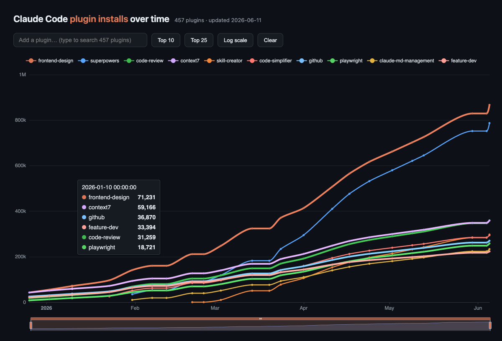

# claude-plugin-stats

Daily scrape of Claude Code plugin install counts from Anthropic's public
plugin-stats endpoint, with history back to **December 2025** recovered from
Arq backups.

## 📈 [Interactive chart of installs over time →](https://primeradiant.com/claude-plugin-stats/)

Search any of the 450+ plugins, toggle log scale, zoom into date ranges, and
hover for exact counts. (GitHub strips JavaScript from READMEs, so the
interactive version lives on GitHub Pages — click through.)

## How it works

A GitHub Action fetches
`https://storage.googleapis.com/claude-code-dist-86c565f3-f756-42ad-8dfa-d59b1c096819/plugin-stats/plugin-details.json`
daily and commits it if it changed — [Simon Willison's git-scraper
pattern](https://simonwillison.net/2020/Oct/9/git-scraping/). The same run
regenerates `docs/data.json` (one `[date, installs]` series per plugin,
extracted from the full git history) which feeds the chart.

## The recovered history

The scrape only started in June 2026, but Claude Code has cached this data
locally since late December 2025 (`~/.claude/plugins/install-counts-cache.json`,
later renamed `plugin-catalog-cache.json`). Weekly snapshots of those files
were recovered from encrypted Arq 7 backups in S3 — including thawing the
relevant pack files out of Glacier — and committed with their original
`fetchedAt` timestamps as commit dates. The patched restore tooling that made
this possible lives at [obra/arq_restore](https://github.com/obra/arq_restore);
the recovery process is documented in [RECOVERY-HANDOFF.md](RECOVERY-HANDOFF.md).

## Files

- `plugin-details.json` — latest snapshot from the public endpoint
- `install-counts-cache.json`, `plugin-catalog-cache.json` — historical local
  cache formats (frozen; present for the recovered history in git log)
- `scripts/build-history.py` — walks git history → `docs/data.json`
- `docs/` — the GitHub Pages chart (ECharts via CDN)
- `.github/workflows/scrape.yml` — daily fetch + commit + data rebuild
